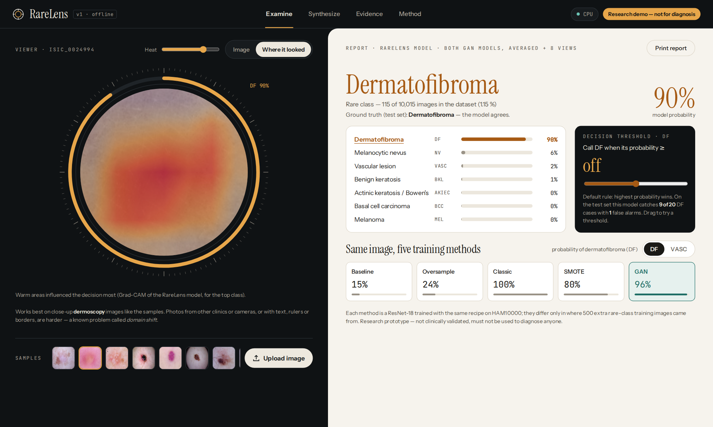
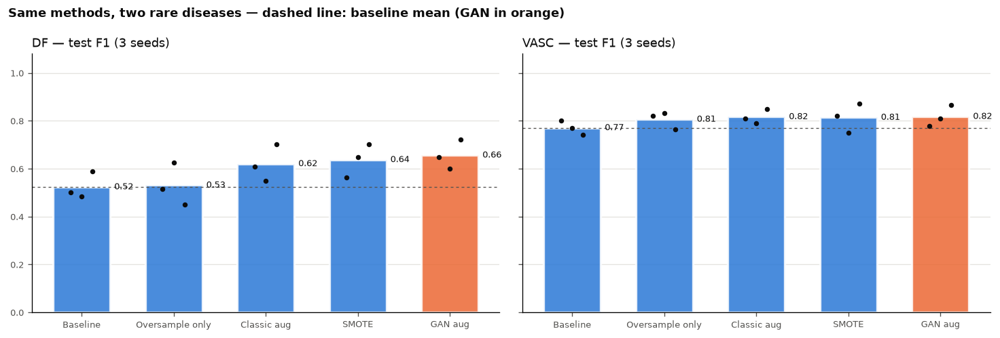
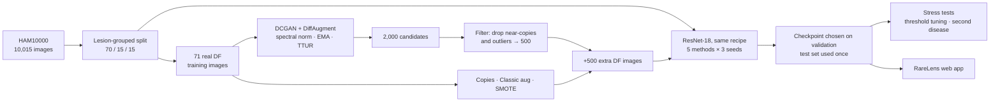
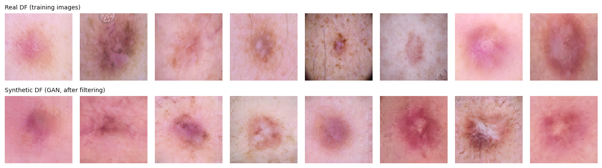
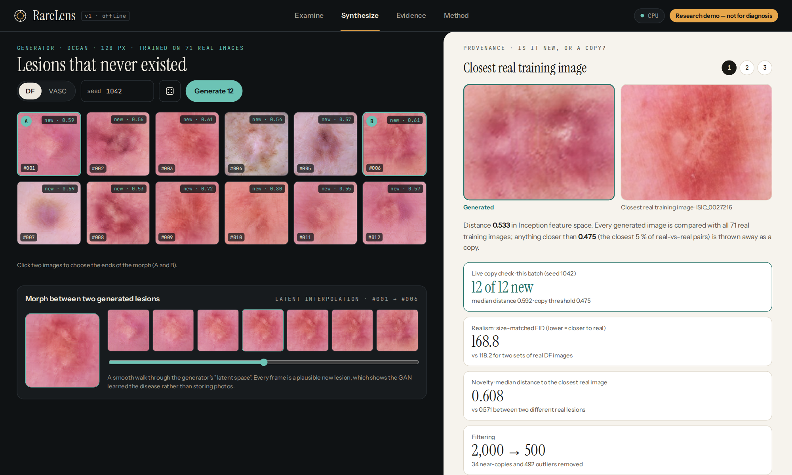
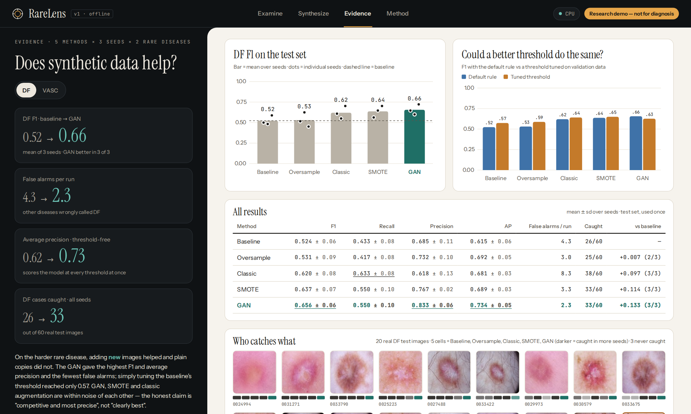
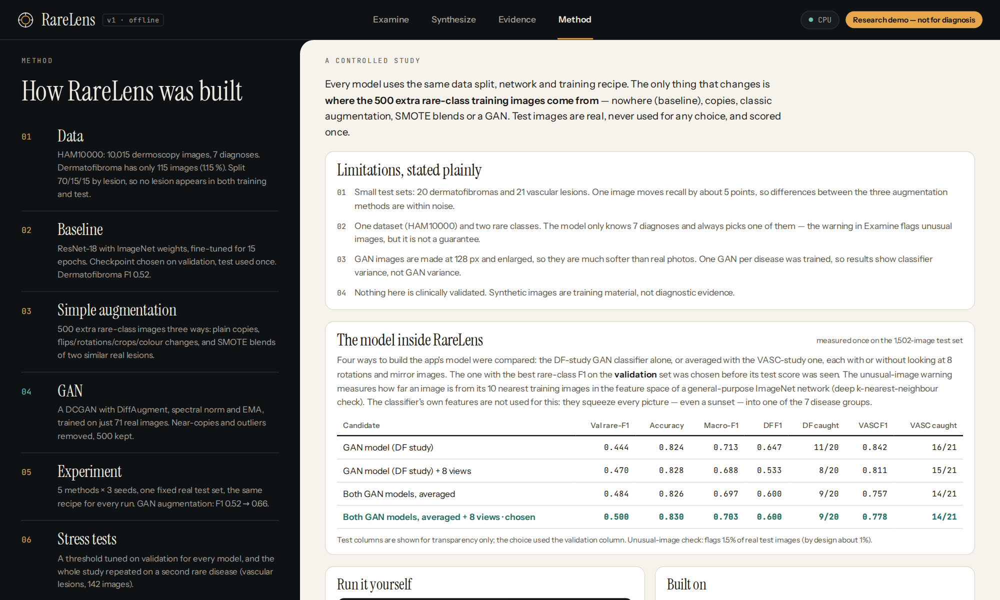
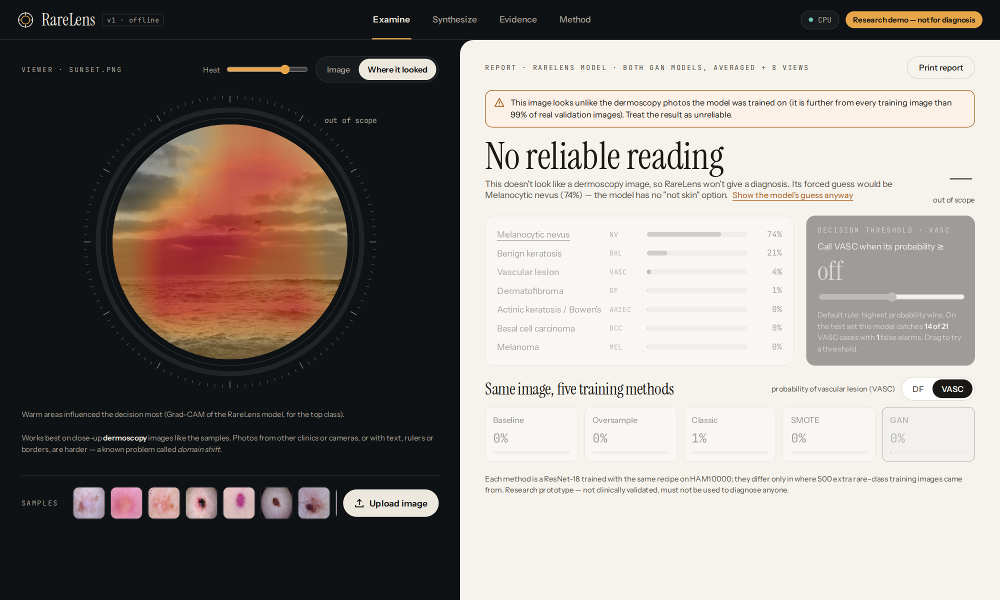

<div align="center">

# RareLens

**Can a GAN trained on just 71 images teach a classifier to recognise a rare skin disease?**

A controlled study of synthetic-data augmentation for rare classes on HAM10000,<br>
with an offline web app that shows the model, the generator and the evidence side by side.

`PyTorch` · `DCGAN + DiffAugment` · `ResNet-18` · `Grad-CAM` · `FID` · `FastAPI` · `vanilla JS`



</div>

---

## TL;DR

Dermatofibroma (DF) is only **1.15 %** of HAM10000 (115 of 10,015 images). A ResNet-18 trained on the data as it is catches fewer than half of the DF cases in the test set.

I added **500 extra DF training images** in five different ways, with everything else held fixed, and ran each variant **3 times with different seeds**:

| Extra DF training images | DF F1 (mean ± sd) | Recall | Precision | Avg. precision | False alarms / run |
|---|---|---|---|---|---|
| None (baseline) | 0.524 ± 0.057 | 0.433 | 0.685 | 0.615 | 4.3 |
| Copies of real images | 0.531 ± 0.088 | 0.417 | 0.732 | 0.692 | 3.0 |
| Classic augmentation | 0.620 ± 0.077 | **0.633** | 0.618 | 0.681 | 8.3 |
| SMOTE-style blends | 0.637 ± 0.071 | 0.550 | 0.767 | 0.689 | 3.3 |
| **GAN (this project)** | **0.656 ± 0.062** | 0.550 | **0.833** | **0.734** | **2.3** |

*Test set: 1,502 real images, 20 of them DF, split by lesion and used once.*

**Findings**

1. **New variation helps; copying does not.** GAN, SMOTE and classic augmentation beat the baseline in every seed. Plain oversampling does not.
2. **The GAN gives the best overall trade-off.** It has the highest F1, precision and average precision, and the fewest false alarms.
3. **It is not just a threshold effect.** Tuning the baseline's decision threshold on validation only reaches F1 0.574, and it floods the results with false alarms (12.7 per run).
4. **On a second rare disease the pattern partly repeats.** On vascular lesions (VASC, 1.42 %) every method helps a little (F1 0.77 → 0.81–0.82). The GAN model is again the most precise, with 0.6 false alarms per run against 2.3 for the baseline.
5. **What I do *not* claim.** GAN, SMOTE and classic augmentation are within noise of each other. With about 20 rare test images, one image moves recall by 5 points.



---

## How it works



**Design choices that keep the comparison fair**

- **Lesion-grouped split.** Several photos of one lesion never end up in both training and test.
- **Equal extra-data budget.** Every method adds exactly 500 rare-class images; only where they come from changes.
- **One training recipe.** Every run uses ResNet-18 with ImageNet weights, AdamW 1e-4, 15 epochs and a cosine schedule.
- **No test peeking.** The checkpoint, the decision threshold and the app's model configuration are all chosen on validation. The test set is scored once.
- **Paired seeds.** Each method is compared with the baseline trained with the same seed.

---

## The GAN: new lesions, not copies



- **Data-efficient training on 71 images:** DiffAugment, a spectral-norm discriminator, hinge loss, an EMA generator and a TTUR learning-rate balance (D 4× faster, 2 D steps per G step). Found by diagnosing a discriminator collapse during development.
- **Memorisation check:** for every generated image, the Inception-feature distance to its closest real training image. The median is 0.61, against 0.57 between two different real lesions. Near-copies (closer than 95 % of real pairs) are removed.
- **Realism, measured fairly:** size-matched FID of 168.8, against 118.2 for two sets of real DF images. The images are softer than real photos (they are generated at 128 px), and they still improve the classifier.
- **Second generator:** the same recipe on vascular lesions reaches FID 156.6 against a real-vs-real reference of 119.8.

## Stress tests (Day 5)

| Question a reviewer would ask | Test | Answer |
|---|---|---|
| "Couldn't you just lower the threshold?" | For all 15 DF models, a threshold tuned on validation and applied once to test | No. The tuned baseline reaches 0.574, below the untuned GAN model (0.656). |
| "Is it a one-off?" | The whole study repeated on vascular lesions: new GAN, new SMOTE set, 15 new runs | Partly. Every method helps a little; the GAN model is again the most precise. |
| "Did the GAN just copy?" | Nearest-real-image distance for every generated image | No. Generated images are as far from their nearest real image as real lesions are from each other. |
| "Does the model use a shortcut?" | Colour and sharpness of synthetic vs real images | The colours match. GAN images are blurrier, and the test set is 100 % real. |

---

## RareLens, the web app

A local, offline app (FastAPI and hand-written HTML/CSS/JS, no external requests). Dark "lightbox" viewer, light "report sheet".

| Examine | Synthesize |
|---|---|
|  |  |
| **Evidence** | **Method** |
|  |  |

<p align="center"><br><em>The reject option: RareLens refuses to diagnose a photo that is not a dermoscopy image.</em></p>

- **Examine.** Upload an image or pick a test-set sample to get the 7-class probabilities and a Grad-CAM heatmap.
  - A **live decision-threshold slider** shows real test-set consequences, for example "catches 9 of 20 with 1 false alarm".
  - The five training methods are compared on the same image.
  - A **reject option** refuses to diagnose non-dermoscopy images. It uses a deep-kNN distance in ImageNet feature space (Sun et al., 2022), calibrated so that 99 % of real validation images pass.
- **Synthesize.** Generate new lesions from any seed. Each image carries a **live copy check** against the training set, and you can morph between two generated lesions through latent space.
- **Evidence.** Interactive charts of every result, including the threshold test and which test images each method catches.
- **Method.** The pipeline, the limitations, and the four candidate app models, with the one chosen on validation.

---

## Repository layout

```
├── notebooks/                    the research record, one notebook per stage
│   ├── 01_day1_baseline.ipynb        data, lesion-grouped split, baseline
│   ├── 02_day2_augmentation.ipynb    copies, classic augmentation, SMOTE
│   ├── 03_day3_gan.ipynb             GAN training, memorisation check, filtering, FID
│   ├── 04_day4_experiment.ipynb      5 methods × 3 seeds, per-image analysis, false alarms
│   └── 05_day5_threshold_and_vasc.ipynb   threshold baseline + second rare disease
├── src/                          the pipeline (importable, used by every notebook)
│   ├── data/                         download, split, image cache, Dataset
│   ├── gan/                          DCGAN, DiffAugment, trainer, filtering, plots
│   ├── train.py  evaluate.py         one training recipe; metrics
│   ├── augment.py  experiments.py    the five methods; run any (method, seed, disease)
│   ├── threshold.py  analysis.py     stress tests; multi-seed analysis
│   └── fid.py                        FID with an exact low-rank Fréchet distance
├── rarelens/                     the web app
│   ├── prepare.py                    collects models, results and examples (no training)
│   ├── engine.py                     inference, Grad-CAM, reject option, GAN
│   ├── server.py                     FastAPI
│   └── static/                       UI (bundled fonts, no CDN)
├── results/                      every table, figure and the full results log
├── app.py  prepare_app.py        entry points
└── requirements.txt
```

## Reproduce

```bash
python -m venv .venv && .venv\Scripts\activate      # Windows (Linux/macOS: source .venv/bin/activate)
pip install -r requirements.txt
# run notebooks 01 → 05 in order (about 3–4 h of GPU time in total; Days 1–3 were first run on a Colab T4, Days 4–5 on an RTX 4060 laptop)
python prepare_app.py      # once: gathers what the app needs
python app.py              # opens RareLens at http://127.0.0.1:8000
```

The dataset (about 2.6 GB) is downloaded by notebook 01 from the public ISIC 2018 archive. Model weights are not in the repository because of their size.

## Limitations

- **Small rare-class test sets** (20 DF, 21 VASC). The three augmentation methods cannot be separated statistically.
- **One dataset, two rare classes.** On internet images from other cameras, accuracy drops (domain shift). The app flags inputs that are clearly out of scope, but that is no guarantee.
- **One GAN per disease**, so the seed spread measures classifier variance, not GAN variance.
- **Selection noise.** The app's model configuration was chosen on validation, and with about 20 rare validation images that choice is noisy (see the Method tab).
- **Not a medical device.** Nothing here is clinically validated.

## Credits

- **Data:** Tschandl, Rosendahl & Kittler (2018), *The HAM10000 dataset*, Scientific Data. Licensed CC BY-NC 4.0.
- **Methods:** Zhao et al. (2020), *DiffAugment*, NeurIPS · Miyato et al. (2018), *Spectral normalisation*, ICLR · Selvaraju et al. (2017), *Grad-CAM*, ICCV · Sun et al. (2022), *Out-of-distribution detection with deep nearest neighbors*, ICML · Heusel et al. (2017), *FID*, NeurIPS.
- **Code:** MIT licence (see `LICENSE`). Fonts: SIL Open Font License.

**Samanpreet Singh** · 2026
